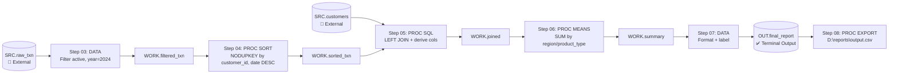
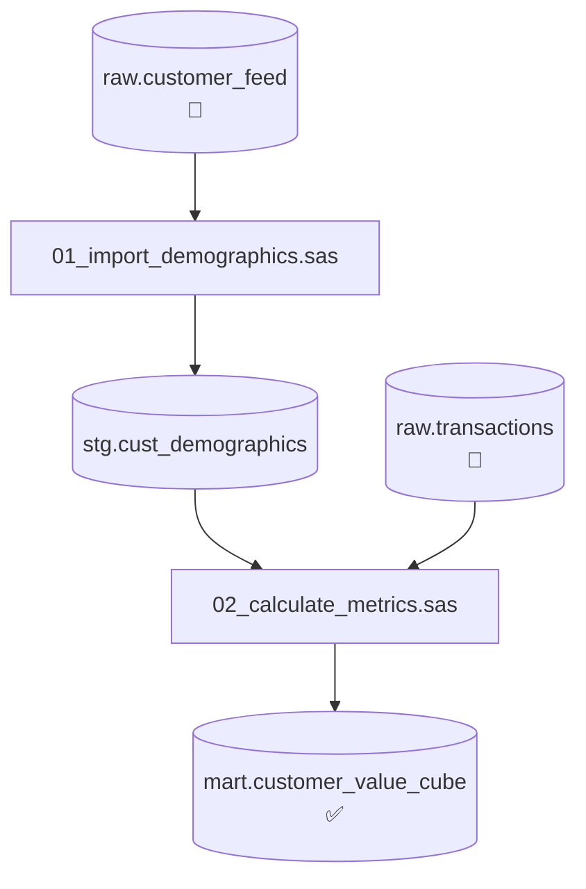
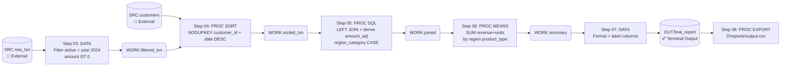
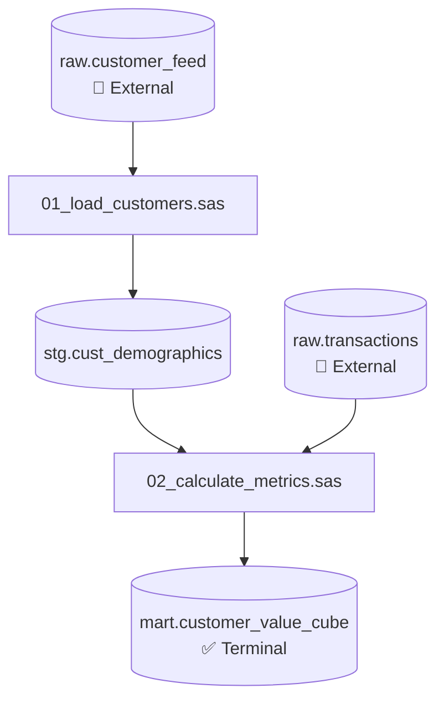

# SAS Engineer — Analysis & Knowledge Base Reference

## How to Use This Skill

**Single-script mode** (Sections 1–11): Analyzing one script in isolation, answering a targeted
question, or producing a quick explanation. Work through sections in order or jump to the
relevant section.

**Knowledge base mode** (Section 12): System contains multiple SAS scripts (5+). Analyze each
script once, write structured `.md` artifacts with Mermaid diagrams, then use those artifacts
for all downstream tasks. Never re-read raw `.sas` files after Phase 1 is complete.

**Validation** (Section 14): Run the validation checklist after every step, every script, and
after the master index. No exceptions.

**Doubt escalation** (Section 15): When proceeding requires an unverified assumption — stop and
ask. Use the structured Doubt Record template. Never guess on lineage or join type.

**Self-refinement** (Section 13): After every session, update `/kb/skill_learnings.md`.
Mandatory. The skill improves through use.

---

## Table of Contents

1. [Program Structure — Big Picture Orientation](#1-program-structure--big-picture-orientation)
2. [Step Classification](#2-step-classification)
3. [DATA Step Analysis](#3-data-step-analysis)
4. [PROC SQL Analysis](#4-proc-sql-analysis)
5. [Other PROC Steps](#5-other-proc-steps)
6. [Macro Analysis](#6-macro-analysis)
7. [Attribute and Variable Analysis](#7-attribute-and-variable-analysis)
8. [Lineage Backtracking](#8-lineage-backtracking)
9. [Dataset Flow Mapping](#9-dataset-flow-mapping)
10. [Patterns and Anti-Patterns](#10-patterns-and-anti-patterns)
11. [Output Formats](#11-output-formats)
12. [Knowledge Base Mode — Per-Script MD & Master Lineage](#12-knowledge-base-mode--per-script-md--master-lineage)
13. [Self-Refinement Protocol](#13-self-refinement-protocol)
14. [Validation Checks](#14-validation-checks)
15. [Doubt Escalation Protocol](#15-doubt-escalation-protocol)

---

## 1. Program Structure — Big Picture Orientation

**Always do this first, before analyzing any individual block.**

### 1.1 Full-Script Scan

Read the entire script top-to-bottom without deep analysis. Build answers to:
- What is the overall shape? Linear pipeline? Macro-driven loop? Conditional branches?
- How many steps are there?
- What are the primary source tables (initial external inputs)?
- What are the final target tables (ultimate outputs)?
- Are there `%INCLUDE` statements pulling in external files? Note their paths — they must be
  analyzed separately and flagged as external dependencies.

### 1.2 Extract Global Declarations

Extract these before analyzing any step — they define the runtime environment everything else runs in.

| Declaration | What to Extract |
|---|---|
| `LIBNAME libref 'path'` | Maps a shorthand to a physical path or database. Every `libref.dataset` reference resolves here. Note the engine if specified (Oracle, DB2, Teradata, ODBC). |
| `FILENAME fileref 'path'` | Maps a fileref to a flat file, pipe, FTP endpoint, or catalog. |
| `%LET var = value;` | Macro variable set at global scope. Substituted as text everywhere `&var` appears. |
| `%GLOBAL var;` | Declares a variable as global — may be populated later by `CALL SYMPUTX`. |
| `OPTIONS ...;` | Runtime flags. Key ones: `COMPRESS=` (storage), `OBS=` (row limit — flag if not MAX), `MPRINT`/`MLOGIC`/`SYMBOLGEN` (macro debugging). |
| `%INCLUDE 'file.sas';` | Inlines an external SAS file. Flag it — that file needs its own analysis. |

### 1.3 Build the Step Inventory

Number every step sequentially. This skeleton anchors all subsequent analysis.

```
Step 01  LIBNAME       — Maps SRC, OUT libraries
Step 02  %LET          — Sets &report_year = 2024, &adj_factor = 1.15
Step 03  DATA          — Reads SRC.raw_txn, filters active records → WORK.filtered_txn
Step 04  PROC SORT     — Sorts WORK.filtered_txn by customer_id, date DESC → WORK.sorted_txn
Step 05  PROC SQL      — Joins with SRC.customers, derives amount_adj → WORK.joined
Step 06  PROC MEANS    — Aggregates revenue by region/product → WORK.summary
Step 07  DATA          — Formats and labels → OUT.final_report
Step 08  PROC EXPORT   — Writes OUT.final_report to D:\reports\output.csv
```

---

## 2. Step Classification

Every block of SAS code is one of these types. Classify correctly before analyzing.

### 2.1 DATA Step
- Starts: `DATA <output_dataset(s)>;` — Ends: `RUN;`
- **Execution model**: processes one observation (row) at a time in a loop. Variables reset to
  missing at the top of each iteration unless `RETAIN`ed. This is the single most important
  concept for understanding DATA step logic.
- Reads from `SET`, `MERGE`, `UPDATE`, or raw `INPUT`.
- Can write to multiple output datasets simultaneously via conditional `OUTPUT` statements.

### 2.2 PROC SQL Step
- Starts: `PROC SQL;` — Ends: `QUIT;`
- May contain multiple SQL statements — each is a sub-unit, analyzed separately.
- Set-based execution (processes all rows at once, unlike DATA step).
- SAS extensions: `CALCULATED`, `MONOTONIC()`, `CONNECTION TO`, `INPUT()`, `PUT()`, `SYMGET()`.

### 2.3 Non-SQL PROC Steps

| PROC | Key Statements | Purpose |
|---|---|---|
| `PROC SORT` | `BY`, `NODUPKEY`, `NODUP`, `DUPOUT=` | Sort and optionally de-duplicate. |
| `PROC MEANS` / `PROC SUMMARY` | `CLASS`, `VAR`, `OUTPUT OUT=` | Aggregate numerics. |
| `PROC FREQ` | `TABLES` | Frequency and cross-tabulation. |
| `PROC TRANSPOSE` | `BY`, `ID`, `VAR`, `PREFIX=` | Pivot wide↔long. |
| `PROC REPORT` | `COLUMN`, `DEFINE`, `COMPUTE` | Reporting; `COMPUTE` blocks can derive columns. |
| `PROC FORMAT` | `VALUE`, `INVALUE`, `PICTURE` | Creates value-mapping catalogs. |
| `PROC IMPORT` / `PROC EXPORT` | `DATAFILE=`, `DBMS=`, `OUT=` | Read/write external files. |
| `PROC DATASETS` | `MODIFY`, `RENAME`, `DELETE`, `APPEND` | Dataset metadata management. |
| `PROC APPEND` | `BASE=`, `DATA=` | Appends DATA= rows to BASE= dataset. |
| `PROC COPY` | `IN=`, `OUT=` | Copies datasets between libraries. |
| `PROC TABULATE` | `CLASS`, `VAR`, `TABLE` | Multi-dimensional summary tables. |
| Statistical PROCs | `PROC REG`, `PROC LOGISTIC`, etc. | Modeling — note `OUTEST=`, `OUTPUT OUT=`. |

### 2.4 Macro Definitions and Calls
- Definition: `%MACRO name(param1=, param2=); ... %MEND name;`
- Call: `%name(param1=value, param2=value);`
- Macros are text substitution — they generate SAS code before execution. Unroll the macro into
  the code it produces, then analyze that code.
- Macro variables (`&name`) resolve at compile time, before any data is read.

### 2.5 Macro Flow Control
```sas
%IF &condition %THEN %DO;
  /* Code block A — only generated if condition is true */
%END;
%ELSE %DO;
  /* Code block B */
%END;
```
Always determine which branch is active before analyzing the contents. An inactive branch
produces no SAS code and has no effect on data.

---

## 3. DATA Step Analysis

### 3.1 Input Sources

**SET statement:**
```sas
DATA output;
  SET lib.source (WHERE=(status='ACTIVE') KEEP=id name amount RENAME=(name=cust_name));
RUN;
```
Extract in order:
- Source dataset (`lib.source` → resolve libref).
- `WHERE=`: filter applied at read time. Only matching rows enter the PDV (Program Data Vector).
- `KEEP=` / `DROP=`: column projection at read time. Excluded columns never enter the PDV.
- `RENAME=`: applied at read time — the new name is what the DATA step body sees.
- `FIRSTOBS=` / `OBS=`: row range — flag if present in production code.

**MERGE statement:**
```sas
DATA merged;
  MERGE left_ds(IN=a) right_ds(IN=b);
  BY key1 key2;
  IF a AND b;
RUN;
```
- `IN=` variables are Boolean flags: `1` if the current row came from that dataset.
- Both datasets **must be pre-sorted** by the BY variables. No visible prior PROC SORT → flag
  ⚠️ MISSING PRE-SORT and escalate (Section 15 D-04).
- Join type from `IF` condition:

| IF Condition | Join Type |
|---|---|
| `IF a;` | Left join |
| `IF b;` | Right join |
| `IF a AND b;` | Inner join |
| `IF a OR b;` | Full outer join |
| `IF NOT b;` | Left anti-join |
| `IF NOT a AND b;` | Right anti-join |
| *(no IF)* | Full outer join (SAS default — often unintentional, always flag) |

**UPDATE statement:**
```sas
DATA master;
  UPDATE master_ds transaction_ds;
  BY key;
RUN;
```
Applies changes from `transaction_ds` onto `master_ds`. Missing values in `transaction_ds`
do NOT overwrite values in `master_ds` (unlike MERGE).

**INPUT statement (raw data):**
```sas
DATA raw;
  INFILE RAWFILE DLM=',' DSD MISSOVER FIRSTOBS=2;
  INPUT id $ name $ amount;
RUN;
```
Note: `DSD` handles quoted fields; `MISSOVER` prevents reading the next line for missing
trailing values; `FIRSTOBS=2` skips a header row. Source is the FILENAME fileref — 🔌 external.

### 3.2 The Program Data Vector (PDV)

The PDV is the in-memory row buffer. Understanding it explains all DATA step behavior:

1. SAS initializes the PDV — all variables set to missing.
2. For each observation, SAS reads input into the PDV.
3. Statements execute top-to-bottom, modifying PDV values.
4. At end of iteration (or explicit `OUTPUT;`), the PDV is written to the output dataset.
5. The PDV resets to missing and the cycle repeats for the next observation.

**RETAIN breaks the reset** — retained variables keep their value from the previous observation.

### 3.3 Variable Derivation Patterns

| Pattern | Example | Key Notes |
|---|---|---|
| Arithmetic | `profit = revenue - cost;` | Operators: + - * / ** |
| String | `clean = STRIP(UPCASE(raw));` | STRIP removes blanks; COMPRESS removes specified chars |
| Substring | `prefix = SUBSTR(code, 1, 3);` | 1-based indexing |
| Concatenation | `full = CATX(' ', first, last);` | CATX inserts delimiter, skips missing |
| Scan | `w2 = SCAN(sentence, 2, ' ');` | Extracts Nth token by delimiter |
| Date arithmetic | `age = TODAY() - birth_date;` | SAS dates are numeric (days since 01JAN1960) |
| Char → date | `dt = INPUT('01JAN2024', DATE9.);` | Returns SAS date numeric |
| Date → char | `s = PUT(dt, DATE9.);` | Returns formatted string |
| Date parts | `yr = YEAR(dt); mo = MONTH(dt);` | Extracts components |
| Date shift | `nxt = INTNX('MONTH', dt, 1, 'B');` | 'B'=beginning 'E'=end 'S'=same day |
| Interval count | `n = INTCK('MONTH', start, end);` | Count of boundaries crossed |
| Inline conditional | `flag = IFN(x>0, 1, 0);` | IFN=numeric; IFC=character result |
| Running total | `RETAIN cum 0; cum + amount;` | `var + expr` implies RETAIN |
| SELECT/WHEN | See below | Multi-branch conditional |
| Array loop | See below | Indexed access to variable groups |

**SELECT/WHEN block:**
```sas
SELECT (status_code);
  WHEN ('A')       label = 'Active';
  WHEN ('I', 'S')  label = 'Inactive';
  WHEN (' ')       label = 'Missing';
  OTHERWISE        label = 'Unknown';
END;
```

**Array processing:**
```sas
ARRAY scores{5} score1-score5;
DO i = 1 TO 5;
  IF scores{i} = . THEN scores{i} = 0;
END;
DROP i;
```
Arrays are compile-time aliases — they don't create new variables. Always `DROP` the loop counter.

### 3.4 Filtering and Row Control

| Mechanism | Behavior |
|---|---|
| `WHERE` statement | Filters before rows enter the PDV. Cannot reference variables created in this DATA step. |
| Subsetting `IF` (no THEN) | `IF condition;` — false rows are dropped. Can reference derived variables. |
| `DELETE;` | Immediately terminates current iteration; row is dropped. |
| `OUTPUT;` | Writes current PDV to output. If used anywhere explicitly, implicit end-of-loop output is suppressed. |
| `STOP;` | Stops the DATA step loop entirely. |

### 3.5 BY-Group Processing

```sas
DATA summary;
  SET detail;
  BY customer_id;
  RETAIN total 0;
  IF FIRST.customer_id THEN total = 0;
  total + amount;
  IF LAST.customer_id THEN OUTPUT;
RUN;
```

- `FIRST.var = 1` on first row of each group; `LAST.var = 1` on last.
- Dataset must already be sorted by BY variables.
- Typical patterns: reset accumulators on `FIRST.`, emit summary row on `LAST.`.

### 3.6 Output Dataset Attributes

On the `DATA` statement or in the step body:
- `KEEP=` / `DROP=` / `RENAME=` as dataset options.
- `LABEL var = 'Description';` — human-readable label.
- `FORMAT var DATE9.;` — display format.
- `LENGTH var $50;` — **declare before first assignment** to avoid truncation.
- `ATTRIB var LENGTH=$50 LABEL='...' FORMAT=$CHAR.;` — combined declaration.

---

## 4. PROC SQL Analysis

### 4.1 Statement Types Inside PROC SQL

A single `PROC SQL; ... QUIT;` block may contain multiple statements. Analyze each independently.

| Statement | Notes |
|---|---|
| `CREATE TABLE lib.out AS SELECT ...` | Primary analysis target — creates a SAS dataset. |
| `CREATE VIEW lib.v AS SELECT ...` | Stored query — re-executed on every reference. Flag ⚠️. |
| `SELECT ...` (no CREATE) | Results Viewer only — no dataset persisted. |
| `INSERT INTO lib.t VALUES (...);` | Row-level insert. |
| `UPDATE lib.t SET col=val WHERE ...;` | Row-level update. |
| `DELETE FROM lib.t WHERE ...;` | Row-level delete. |
| `DROP TABLE lib.t;` | Drops a dataset. |
| `SELECT ... INTO :var FROM ...;` | Stores result into a macro variable — cross-step dependency. |
| `CONNECT TO / DISCONNECT FROM` | Pass-through to external database. |

### 4.2 SELECT Statement — Layer-by-Layer Decomposition

Decompose every SELECT into these layers in order:

#### Layer 1 — SELECT: Output Columns

For each column, classify and document:

| Column Type | Signal | Document |
|---|---|---|
| Direct pass-through | `alias.column` | Source table alias, original column name |
| Renamed | `alias.col AS new_name` | Source column, alias |
| Arithmetic | `a.price * a.qty AS revenue` | Full expression, all input columns |
| CASE/WHEN | `CASE WHEN ... THEN ... END AS label` | All conditions and result values |
| Aggregate | `SUM(a.amount) AS total` | Function, input column, implied GROUP BY |
| CALCULATED | `CALCULATED prev_col * 0.05 AS fee` | Unroll the full chain to base columns |
| Scalar subquery | `(SELECT MAX(dt) FROM lib.t) AS max_dt` | Analyze inner SELECT recursively |
| Constant | `'ACTIVE' AS status` | Document as 📌 hard-coded |
| Macro-substituted | `&macro_var AS col` | Trace macro variable to its assignment |

**CALCULATED keyword**: SAS-specific. References a column alias defined earlier in the same
SELECT clause. Always unroll the full chain — if A → CALCULATED B → CALCULATED C, expand C
all the way back to its base source columns.

#### Layer 2 — FROM: Source Tables

```sql
FROM lib.transactions a
```
- Full dataset reference `libref.datasetname` — resolve the libref.
- Alias assigned (`a`) — all `a.column` references resolve here.
- Dataset options are valid: `FROM lib.ds (WHERE= KEEP= RENAME=)`.
- Subquery in FROM: treat as a virtual table — analyze inner SELECT recursively.

#### Layer 3 — JOINs

```sql
LEFT JOIN lib.customers b  ON a.customer_id = b.customer_id
INNER JOIN lib.products c  ON a.product_id = c.product_id AND c.active = 1
```

Document for each JOIN:
- Join type (INNER / LEFT / RIGHT / FULL OUTER / CROSS).
- Joined dataset and alias — resolve the libref.
- Join key(s) — every condition in the ON clause.
- Effect on rows: LEFT keeps all left rows (right columns NULL on no-match); INNER drops
  unmatched rows; FULL OUTER keeps all rows from both sides.
- Non-equi joins (`ON a.price BETWEEN b.low AND b.high`): flag — can produce row fan-out.

#### Layer 4 — WHERE: Row Filtering

```sql
WHERE a.date BETWEEN '01JAN2024'D AND '31DEC2024'D
  AND b.region IN ('NORTH', 'SOUTH')
  AND EXISTS (SELECT 1 FROM lib.approved ap WHERE ap.id = a.id)
```

Document every condition. Flag:
- 📌 Hard-coded date literals and year values.
- `IN (subquery)`: if subquery can return NULL → entire IN clause may return zero rows.
- `NOT IN (subquery)`: if subquery returns ANY NULL → NOT IN returns ZERO rows. Critical risk.
- `EXISTS` / `NOT EXISTS`: correlated subqueries — analyze inner SELECT separately.
- Macro variables in WHERE: document substituted value.

#### Layer 5 — GROUP BY

```sql
GROUP BY a.region, a.product_type
```
Defines output granularity. Every non-aggregate SELECT column must appear here.
Document explicitly: *"Output granularity: one row per region + product_type combination."*

#### Layer 6 — HAVING

```sql
HAVING SUM(a.amount) > 10000 AND COUNT(*) >= 5
```
Applied after GROUP BY. Filters on aggregated values. Can reference CALCULATED aliases.

#### Layer 7 — ORDER BY

```sql
ORDER BY a.region ASC, total_revenue DESC
```
SAS datasets do not guarantee preservation of ORDER BY in downstream steps unless followed
by PROC SORT. Flag if downstream steps assume a specific row order.

#### Layer 8 — Set Operations

```sql
SELECT a, b FROM lib.t1
UNION ALL
SELECT a, b FROM lib.t2
```
- `UNION`: de-duplicates. `UNION ALL`: keeps all rows (faster — prefer unless de-dup required).
- `INTERSECT`: rows in both. `EXCEPT`: rows in first but not second.
- Column count and types must match between all sets.

### 4.3 SAS SQL Extensions Reference

| Extension | Syntax | Meaning |
|---|---|---|
| CALCULATED | `CALCULATED alias` | References alias defined earlier in same SELECT |
| MONOTONIC() | `MONOTONIC() AS rownum` | Sequential counter — unreliable in queries with JOINs |
| Date literal | `'01JAN2024'D` | Numeric value = days since 01JAN1960 |
| INPUT() | `INPUT(str_col, DATE9.)` | Character → numeric/date |
| PUT() | `PUT(date_col, DATE9.)` | Numeric/date → character |
| SYMGET() | `SYMGET('macro_var')` | Reads macro variable at SQL execution time (runtime, not compile) |
| COALESCE() | `COALESCE(a, b, c)` | First non-NULL/non-missing value |
| SELECT INTO | `SELECT MAX(dt) INTO :maxdt FROM ...` | Stores result in macro variable |
| OUTOBS= | `PROC SQL OUTOBS=1000;` | Limits output rows |
| NOPRINT | `PROC SQL NOPRINT;` | Suppresses Results Viewer output |
| FEEDBACK | `PROC SQL FEEDBACK;` | Prints SQL after macro substitution — debug flag |

### 4.4 Pass-Through Queries

```sas
PROC SQL;
  CONNECT TO oracle (path='findb' user=&user password=&pw schema=finance);
  CREATE TABLE WORK.gl AS
    SELECT * FROM CONNECTION TO oracle (
      SELECT acct_id, SUM(amount) AS total
      FROM finance.gl_transactions
      WHERE posting_date >= ADD_MONTHS(SYSDATE, -12)
      GROUP BY acct_id
    );
  DISCONNECT FROM oracle;
QUIT;
```

- Inner SQL is native to the target engine (Oracle, DB2, Teradata, SQL Server).
- The source table is 🔌 an external database — document system, schema, table, and filter.
- The result lands in SAS as a regular dataset and is analyzed from there.

### 4.5 Macro Variables in SQL

```sql
WHERE year = &report_year          /* numeric — substituted as-is */
  AND status IN (&status_list)     /* may expand to 'A','I','S' — verify expansion */
  AND flag = "&active_flag"        /* character — double quotes allow macro resolution */
```

Single-quoted strings `'&var'` do NOT resolve macros. Double-quoted `"&var"` do.
Always trace every `&variable` in SQL to its assignment.

---

## 5. Other PROC Steps

### 5.1 PROC SORT

```sas
PROC SORT DATA=lib.input OUT=lib.output NODUPKEY DUPOUT=lib.dupes;
  BY key1 key2 DESCENDING amount;
RUN;
```

| Element | Notes |
|---|---|
| `DATA=` | Input dataset |
| `OUT=` | Output dataset (omit = sorts in place) |
| `NODUPKEY` | Keeps first row per unique BY-key combination. Sort direction determines which row is "first". |
| `NODUP` | Removes rows identical across ALL columns — rarely what's intended for a key de-dup. |
| `DUPOUT=` | Removed duplicate rows sent here |
| `DESCENDING` | Applies to the immediately following variable only |

**Lineage note**: PROC SORT is transparent to attribute lineage — no columns created or modified.
Only row order changes, and rows may be removed (NODUPKEY/NODUP).

### 5.2 PROC MEANS / PROC SUMMARY

```sas
PROC MEANS DATA=lib.detail NWAY NOPRINT;
  CLASS region product_type;
  VAR revenue units cost;
  OUTPUT OUT=lib.summary
    SUM(revenue)=total_rev SUM(units)=total_units
    MEAN(revenue)=avg_rev N(revenue)=row_count;
RUN;
```

| Element | Notes |
|---|---|
| `CLASS` | Grouping variables — equivalent to GROUP BY |
| `VAR` | Numeric variables to aggregate |
| `NWAY` | Outputs only the most detailed level. Without NWAY, SAS also outputs subtotals. |
| `OUTPUT OUT=` | `STAT(input_var)=output_name` pattern defines output columns |
| `_TYPE_` | Binary encoding of which CLASS vars are active in that row |
| `_FREQ_` | Row count per group |

Available statistics: `SUM`, `MEAN`, `N`, `NMISS`, `MIN`, `MAX`, `RANGE`, `STD`, `VAR`,
`STDERR`, `CV`, `MEDIAN`, `MODE`, `P1` `P5` `P10` `P25` `P50` `P75` `P90` `P95` `P99`.

### 5.3 PROC TRANSPOSE

```sas
PROC TRANSPOSE DATA=lib.long OUT=lib.wide PREFIX=month_ NAME=source_col;
  BY customer_id;
  ID period;
  VAR amount;
RUN;
```

| Element | Notes |
|---|---|
| `BY` | Row identity in wide output — one output row per unique BY combination |
| `ID` | Variable whose distinct values become new column names |
| `VAR` | Variable whose values fill the new columns |
| `PREFIX=` | Prepended to ID values (required when ID values start with digits) |
| `NAME=` | Name for the `_NAME_` column in output |

**Lineage note**: Wide columns (`PREFIX_idvalue`) did not exist as columns in the source —
they were row values of the ID variable. Document this pivot transformation explicitly.

### 5.4 PROC FORMAT

```sas
PROC FORMAT LIBRARY=lib.formats;
  VALUE $status_fmt 'A'='Active' 'I','S'='Inactive' OTHER='Unknown';
  VALUE revenue_tier LOW-<100='Bronze' 100-<1000='Silver' 1000-HIGH='Gold';
  INVALUE $code_infmt 'Active'='A' 'Inactive'='I';
QUIT;
```

- Stored in a **format catalog** (default `WORK.FORMATS`; permanent if `LIBRARY=` specified).
- `VALUE`: display formats — used in `FORMAT` statements and `PUT()` calls.
- `INVALUE`: input formats — used in `INFORMAT` statements and `INPUT()` calls.
- When `PUT(var, $status_fmt.)` appears, it performs a value translation — document the full
  mapping as a business rule in the Business Rules Catalog.

### 5.5 PROC IMPORT / PROC EXPORT

```sas
PROC IMPORT DATAFILE='D:\data\rates.csv' OUT=WORK.rates DBMS=CSV REPLACE;
  DELIMITER=','; GETNAMES=YES; DATAROW=2;
RUN;
```

- `DATAFILE=`: physical file path — 🔌 external source.
- `DBMS=`: file type (CSV, EXCEL, TAB, DLM, XLSX, ACCESS).
- `GETNAMES=YES`: first row used as column names.
- Column types are inferred by SAS — flag character columns that may have been guessed wrong.

### 5.6 PROC DATASETS

```sas
PROC DATASETS LIBRARY=WORK NOLIST;
  MODIFY filtered_txn;
    RENAME old_name = new_name;
    LABEL amount = 'Transaction Amount (USD)';
    FORMAT date DATE9.;
  DELETE temp1 temp2;
QUIT;
```

Modifies dataset metadata without reading data. `RENAME` inside PROC DATASETS is a lineage
break point — the column existed under the old name before this step.

---

## 6. Macro Analysis

### 6.1 Macro Definition Anatomy

```sas
%MACRO process_period(inlib=WORK, outlib=OUT, period=, debug=N);
  %LOCAL i step_count;
  %IF &debug = Y %THEN %PUT NOTE: Processing period &period;
  /* ... SAS steps ... */
%MEND process_period;
```

Document for every macro:
- Name and all parameters (required vs. optional with defaults).
- `%LOCAL` variables — scope limited to this macro invocation.
- `%GLOBAL` variables set inside — persist after the macro ends.
- What SAS code it generates (unroll loops mentally and document all generated datasets).
- Which external datasets or macro variables it reads and writes.

### 6.2 Macro Variable Scoping

Resolution order when `&varname` is encountered:
1. Local symbol table of current macro.
2. Local symbol tables of enclosing macros (nested call stack), innermost first.
3. Global symbol table.

If not found in any scope, SAS issues a WARNING and substitutes the literal `&varname` text —
this silently corrupts SQL queries or filenames. Flag ⚠️ UNRESOLVED MACRO VAR.

### 6.3 Macro Variable Assignment Methods

| Method | Where Used | Scope | Notes |
|---|---|---|---|
| `%LET var = value;` | Anywhere | Current scope | Simple text assignment |
| `%GLOBAL var;` then `%LET` | Macro body | Global | Explicit global promotion |
| `%LOCAL var;` then `%LET` | Macro body | Local | Prevents polluting global scope |
| `CALL SYMPUT('var', value)` | DATA step | Global | Value available in NEXT step only |
| `CALL SYMPUTX('var', value)` | DATA step | Global | Like SYMPUT but strips whitespace. Prefer this. |
| `SELECT ... INTO :var` | PROC SQL | Global | Stores query result in macro variable |
| `%SYSFUNC(...)` | Macro expression | Current | DATA step function executed at compile time |

**Critical timing rule**: `CALL SYMPUTX` and `SELECT INTO :var` set the macro variable AFTER
the step completes. No code within the same step can read the new value.

### 6.4 Common %SYSFUNC Patterns

```sas
%LET today       = %SYSFUNC(TODAY(), DATE9.);
%LET nobs        = %SYSFUNC(ATTRN(%SYSFUNC(OPEN(lib.ds,I)),NOBS));
%LET file_exists = %SYSFUNC(FILEEXIST('D:\data\input.csv'));
```

### 6.5 Iterative Macros — Unrolling

```sas
%MACRO process_all(n=);
  %DO i = 1 %TO &n;
    PROC SQL;
      CREATE TABLE WORK.result_&i AS SELECT * FROM lib.source WHERE period = &i;
    QUIT;
  %END;
%MEND;
%process_all(n=12);
```

This generates 12 PROC SQL blocks — output tables `WORK.result_1` through `WORK.result_12`.
Document all generated datasets. Treat the unrolled code as the actual step inventory.

---

## 7. Attribute and Variable Analysis

### 7.1 Attribute Properties

| Property | Defined By | Notes |
|---|---|---|
| **Name** | First assignment, `LENGTH`, or `ATTRIB` | Max 32 chars in SAS 9.4+ |
| **Type** | First assignment or `LENGTH` | Numeric or Character — SAS has only two types |
| **Length** | `LENGTH` statement or first assignment | Char: byte count ($1–$32767); Num: 3–8 bytes |
| **Format** | `FORMAT` or `ATTRIB` | Controls display (DATE9., COMMA12.2, $STATUS_FMT.) |
| **Informat** | `INFORMAT` or `ATTRIB` | Controls how raw text is read in |
| **Label** | `LABEL` or `ATTRIB` | Human-readable description, up to 256 chars |

**Length trap**: If a character variable is first assigned a short string (`status = 'Y';`),
its length is set to 1 — longer values are silently truncated. Always declare `LENGTH` before
the first assignment for character variables.

### 7.2 Attribute Classification

| Class | Definition | Aliased? |
|---|---|---|
| Pass-through | Read from source, passed unchanged | No |
| Renamed pass-through | Same data, different name | Yes |
| Derived — arithmetic | Math expression: +, -, *, /, ** | No |
| Derived — string | String functions: STRIP, SUBSTR, CATX, SCAN, etc. | No |
| Derived — conditional | IF/ELSE, SELECT/WHEN, CASE/WHEN | No |
| Derived — aggregate | SUM, COUNT, AVG, MAX, MIN, etc. | No |
| Derived — lookup/format | PUT(var, fmt.) or joined from reference table | No |
| Derived — pivot | Result of PROC TRANSPOSE | No |
| Macro-injected | `&macro_var` substituted into expression | No |
| Constant | Hard-coded literal — no column reference | No |
| System/automatic | `_N_`, `_ERROR_`, `FIRST.`, `LAST.`, `_TYPE_`, `_FREQ_` | No |

### 7.3 Finding Where an Attribute Is First Defined

Scan in this priority order:
1. `ATTRIB var LENGTH=... LABEL=... FORMAT=...;`
2. `LENGTH var $20;` or `LENGTH var 8;`
3. `RENAME old = var;` or `RENAME=(old=var)` option — earlier name
4. First `var = expression;` assignment
5. `INPUT` statement — raw data read
6. Incoming from `SET` / `MERGE` — inherited from source dataset

---

## 8. Lineage Backtracking

### 8.1 The Backtracking Algorithm

Start from the **target attribute in the final output**. Apply these steps recursively until
every path terminates at an External Source, a Constant, or a System variable.

```
FUNCTION trace(attribute, dataset):

  1. Find the step that writes `dataset`.
  2. Classify `attribute` in that step (Section 7.2).
  3. Based on classification:

     Pass-through:
       → RECURSE: trace(attribute, step's input dataset)

     Renamed pass-through:
       → find RENAME=; get original_name
       → RECURSE: trace(original_name, step's input dataset)

     Derived (arithmetic / string / conditional):
       → document the full expression
       → for each input column: RECURSE: trace(input_col, step's input datasets)

     Derived — aggregate:
       → document: function + input column + grouping keys + WHERE/HAVING filter
       → RECURSE: trace(input_col, step's input datasets)

     Derived — lookup/format:
       → PUT(var, fmt.): find PROC FORMAT; document full value mapping
       → Joined ref table: RECURSE: trace(col, reference_table)
       → Then: RECURSE: trace(source_var, ...)

     Macro-injected:
       → find %LET / CALL SYMPUTX / SELECT INTO that sets the variable
       → if static: STOP — document as 📌 constant
       → if computed: RECURSE into the computation

     Constant:
       → STOP 📌. Document: value, where hard-coded, what it represents.

     External Source (no producing step in this system):
       → STOP 🔌. Document: system, path/schema, table, column name.
```

### 8.2 Cross-Step Rules

| Crossing | Rule |
|---|---|
| PROC SORT | Transparent — attribute came from `DATA=` input unchanged. Step back. |
| PROC MEANS | Output column derived by applying statistic to VAR column over CLASS grouping. Trace the VAR column. |
| PROC TRANSPOSE | Wide columns came from values of VAR column, pivoted by ID column values. Trace VAR column. |
| DATA step MERGE | Determine which input dataset contributed using IN= flag logic and BY keys. |
| PROC SQL JOIN | Resolve alias to source dataset. Subquery → descend and recurse. |
| %INCLUDE boundary | Attribute defined/transformed in an external file. Flag 🔌 — separate analysis needed. |
| CALL SYMPUTX / SELECT INTO | Trace backward to the DATA step / SQL expression that produced the value. |
| SAS VIEW | View re-executes its definition on every reference. Trace through the view definition. |

### 8.3 RETAIN Dependencies

```sas
RETAIN running_total 0;
running_total + amount;
```

`running_total` at observation N = SUM of `amount` from observations 1 through N (within the
current BY group). Its lineage depends on ALL prior rows. Document:

```
RETAIN dependency: running_total at row N = SUM(amount, rows 1..N) within current BY group
Initializer: 0 (constant)
Reset trigger: IF FIRST.customer_id THEN running_total = 0;  ← verify this exists
```

### 8.4 Lineage Notation Standard

```
OUT.FINAL_REPORT.AMOUNT_ADJ
  ← [Step 07 DATA] Pass-through from WORK.SUMMARY.AMOUNT_ADJ
      ← [Step 06 PROC MEANS] SUM(WORK.JOINED.AMOUNT_ADJ) grouped by REGION, PRODUCT_TYPE
          ← [Step 05 PROC SQL] Derived-arithmetic: AMOUNT × &adj_factor
              ← AMOUNT
                  ← [Step 03 DATA] Pass-through, filtered: amount > 0
                      🔌 SRC.RAW_TXN.AMOUNT ← D:\data\source\ (SAS library)
              ← &adj_factor = 1.15
                  🔧 %LET Step 02 📌 hard-coded

OUT.FINAL_REPORT.REGION_CATEGORY
  ← [Step 05 PROC SQL] Derived-conditional: CASE WHEN REGION IN ('NORTH','SOUTH') → 'Domestic' ...
      ← REGION
          ← LEFT JOIN SRC.CUSTOMERS ON CUSTOMER_ID
              ⚠️ REGION = NULL when no customer match → REGION_CATEGORY = 'Unknown'
              🔌 SRC.CUSTOMERS.REGION ← D:\data\source\ (SAS library)
```

**Notation key:**
- `←` lineage direction (output derived from source on right)
- `🔌` external system boundary
- `📌` hard-coded constant
- `🔧` macro variable dependency
- `⚠️` risk or anomaly

---

## 9. Dataset Flow Mapping

### 9.1 Flow Entry Format

```
[Step 05] PROC SQL
  INPUTS:      WORK.SORTED_TXN (alias t), SRC.CUSTOMERS (alias c)
  OUTPUTS:     WORK.JOINED
  JOIN TYPE:   LEFT JOIN on t.customer_id = c.customer_id
  ROW FILTER:  t.date BETWEEN '01JAN2024'D AND '31DEC2024'D
  GRANULARITY: One row per transaction (txn_id is the natural key)
  DERIVES:     amount_adj, estimated_fee, region_category
```

**Always document granularity** — it is one of the most frequently omitted and most important facts.

### 9.2 Dataset Classification

| Category | Characteristics | Symbol |
|---|---|---|
| External Source | Referenced as input; never created by any step in this system | 🔌 |
| WORK Intermediate | Created and consumed within the same script; temporary | — |
| Permanent Intermediate | Written to permanent library; also consumed within this system | — |
| Terminal Output | Created by this system; not consumed by any step within this system | ✅ |
| Unresolved | Referenced as input; origin cannot be confirmed | ⚠️ |

### 9.3 Mermaid Flow Diagram

Generate a Mermaid diagram for every script's flow. This is the primary visual artifact in the
per-script `.md` file and in `master_lineage.md`.

**Per-script diagram template:**


**Mermaid node conventions:**
- `[(label)]` — cylindrical shape for persistent datasets (external sources, permanent outputs)
- `[label]` — rectangle for processing steps
- `(label)` — rounded rectangle for temporary/WORK datasets
- Label format for steps: `Step NN: TYPE\nBrief description`
- Label format for datasets: `LIBREF.DATASET_NAME\nclassification symbol`
- Use `\n` for line breaks within labels

**Cross-script master lineage diagram:**


---

## 10. Patterns and Anti-Patterns

### 10.1 Patterns to Recognize

**First-occurrence selection (de-dup to latest record):**
```sas
PROC SORT DATA=ds; BY id DESCENDING date; RUN;
DATA deduped;
  SET ds;
  BY id;
  IF FIRST.id;  /* Keeps first = highest date due to descending sort */
RUN;
```
Always document sort key, direction, and which record is retained.

**PROC SQL macro variable capture:**
```sas
PROC SQL NOPRINT;
  SELECT MAX(date) FORMAT=DATE9. INTO :max_dt TRIMMED FROM WORK.detail;
QUIT;
/* &max_dt now available to all subsequent steps */
```
Document as a 🔧 cross-step (or cross-script) macro variable dependency.

**Hash table lookup (in-memory reference join):**
```sas
DATA result;
  IF _N_ = 1 THEN DO;
    DECLARE HASH h(dataset:'lib.lookup');
    h.defineKey('code');
    h.defineData('description');
    h.defineDone();
  END;
  SET lib.main;
  rc = h.find();
  IF rc = 0 THEN output_col = description;
RUN;
```
Lineage: `description` comes from `lib.lookup.description` looked up by `lib.main.code`.
`lib.lookup` is loaded entirely into memory on first iteration — 🔌 external dependency.

**Running total with group reset:**
```sas
DATA with_running;
  SET detail;
  BY customer_id;
  RETAIN cum_amount 0;
  IF FIRST.customer_id THEN cum_amount = 0;
  cum_amount + amount;
RUN;
```
Reset pattern is correct — `cum_amount` restarts for each customer.

### 10.2 Anti-Patterns — Flag and Document

| Anti-Pattern | Risk | Flag |
|---|---|---|
| Character variable length from first short assignment | Truncation of longer values | ⚠️ LENGTH NOT DECLARED |
| `IN (subquery)` where subquery may return NULL | IN clause evaluates to NULL — zero rows | ⚠️ NULL IN SUBQUERY |
| `NOT IN (subquery)` where subquery may return NULL | NOT IN returns ZERO rows | ⚠️ CRITICAL NULL NOT IN |
| MERGE without prior PROC SORT | Results undefined; may ERROR or silently corrupt | ⚠️ MISSING PRE-SORT |
| MERGE without IF condition | Full outer join (SAS default) — rarely intended | ⚠️ UNCONFIRMED JOIN TYPE |
| RETAIN without group reset | Previous group value bleeds into new group | ⚠️ RETAIN NO RESET |
| `MONOTONIC()` in JOIN query | Row numbers unreliable after join | ⚠️ MONOTONIC IN JOIN |
| Hard-coded date literals | Breaks at period boundaries | 📌 HARD-CODED DATE |
| Hard-coded year in macro variable | Must be updated manually each period | 📌 HARD-CODED PERIOD |
| Unresolved macro variable reference | Literal `&varname` text injected into code | ⚠️ UNRESOLVED MACRO VAR |
| PROC SQL with no WHERE on large table | Full table scan | ⚠️ NO FILTER ON LARGE TABLE |
| Multiple OUTPUT to same dataset | Duplicate rows or unexpected interleaving | ⚠️ MULTIPLE OUTPUT |
| `CREATE VIEW` in PROC SQL | Re-executes on every reference — expensive | ⚠️ VIEW NOT TABLE |
| `NODUP` instead of `NODUPKEY` | All-column de-dup vs. key-only — rarely intended | ⚠️ NODUP VS NODUPKEY |
| LENGTH declared after first assignment | SAS ignores it — type and length already set | ⚠️ LATE LENGTH DECLARATION |
| ORDER BY result assumed persistent | SAS doesn't guarantee order without PROC SORT | ⚠️ ORDER NOT GUARANTEED |
| `OBS=` option set to non-MAX value | Testing limit applied in production — reads partial data | ⚠️ OBS LIMIT IN PRODUCTION |
| `CALL SYMPUT` same-step read | Macro variable not yet available in current step | ⚠️ SYMPUT TIMING VIOLATION |

---

## 11. Output Formats

### 11.1 Full Script Analysis

Structure output as these sections in order:

**Section 1 — Executive Summary**
- Purpose: 2–4 sentence plain-language description of what this script accomplishes.
- Primary source tables (all initial external inputs).
- Final target table(s) (ultimate outputs).

**Section 2 — Global Execution Metadata**
- Input dependencies: database schemas, files, LIBNAMEs referenced.
- Output artifacts: tables created, exported files.
- Macro variables: set and consumed.

**Section 3 — Step-by-Step Logic and Data Transformations**
For each step: type, objective, source tables, target table, and the attribute transformation
table (see Section 12.2 Step Detail for the exact table format).

**Section 4 — Script-Level Data Lineage Trace**
Mermaid diagram of the full data flow within this script (see Section 9.3).

**Section 5 — Attribute Dictionary**
All attributes in each permanent output dataset.

**Section 6 — Lineage Traces**
Full ← chains for all non-trivial attributes.

**Section 7 — Business Rules Catalog**
Every filter, condition, classification, and derivation rule in plain language.

**Section 8 — Flags and Risks**
All flagged items with type and recommended action.

### 11.2 Targeted Attribute Lineage

When asked "where does attribute X come from?":
1. State where X appears in the final output dataset.
2. Provide the full ← lineage chain with every step labelled.
3. Label every transformation and system boundary.
4. State the ultimate source.
5. Flag any semantics-changing transformations: filters that restrict population, aggregations
   that change granularity, formats that change displayed value, pivots that reshape structure.

### 11.3 Impact Analysis

When asked "what is affected if I change column X in table T?":
1. Find all scripts that read table T (from master_index Table Registry).
2. In each script, find all attributes that derive from X directly or transitively.
3. For each downstream attribute, document the transformation chain from X.
4. Identify all business rules and filters that reference X.
5. List all terminal output tables that contain a value derived from X.

---

## 12. Knowledge Base Mode — Per-Script MD & Master Lineage

Use this mode for any system with 5 or more SAS scripts. For 50+ scripts, this is mandatory.

**The principle**: analyze each script once, write structured artifacts, then serve all downstream
tasks from the artifacts. Raw `.sas` files are never re-read after Phase 1.

---

### 12.1 Output Directory Structure

```
/kb/
├── master_lineage.md                    ← Cross-script lineage, dependency map, Mermaid (built last)
├── doubt_log.md                         ← All doubt records and resolutions
├── skill_learnings.md                   ← Session learnings (Section 13)
├── scripts/
│   ├── script_001_<name>.md             ← One file per SAS script
│   ├── script_002_<name>.md
│   └── ...
├── tables/
│   └── _table_index.md                  ← All tables: producer, consumers, physical location
├── macros/
│   └── _macro_index.md                  ← All macros: definition, call sites, parameters
└── attributes/
    └── _attribute_index.md              ← All columns across all permanent output tables
```

**Naming convention**: `script_NNN_<original_name>.md` — NNN = execution order, zero-padded.
Unknown order: use `script_<name>.md` and flag ⚠️ UNCONFIRMED ORDER.

---

### 12.2 Per-Script MD File — Full Template

Every section is mandatory. Write `None` or `N/A` explicitly — absence is information.

````markdown
# SAS Script Analysis: [script_filename.sas]

## 1. Executive Summary
- **Purpose:** [2–4 sentences: what this script does and why it exists in the pipeline.]
- **Primary Source Tables:** [All external input tables — what enters this script from outside.]
- **Final Target Table(s):** [The ultimate output(s) produced — what leaves this script.]

---

## 2. Global Execution Metadata

### Libraries (LIBNAME)
| Libref | Physical Path / Connection | Engine | Type |
|--------|---------------------------|--------|------|
| WORK | Temporary SAS library | BASE | SAS temp |
| SRC | D:\data\source\ | BASE | SAS permanent |
| DB2LIB | DB2: server=mydb, schema=dbo | DB2 | Database |

### Filenames (FILENAME)
| Fileref | Path / Endpoint | Purpose |
|---------|----------------|---------|
| RAWFILE | D:\inbound\rates.csv | CSV input |

### Input Dependencies
| Dataset / File | Libref / Fileref | Source Type | Physical Location |
|---------------|-----------------|-------------|-------------------|
| SRC.raw_txn | SRC | SAS Library | D:\data\source\ |
| SRC.customers | SRC | SAS Library | D:\data\source\ |
| D:\inbound\rates.csv | RAWFILE | Flat File | D:\inbound\ |

### Output Artifacts
| Dataset / File | Libref | Permanent? | Final Target? | Description |
|---------------|--------|------------|---------------|-------------|
| OUT.final_report | OUT | Yes | Yes | Final reporting table |
| D:\reports\output.csv | — | Yes | Yes | Exported CSV |
| WORK.joined | WORK | No | No | Intermediate join result |

### Macro Variables — Set in This Script
| Variable | Set By | Value or Expression | Scope | Consumed By |
|----------|--------|---------------------|-------|-------------|
| &report_year | %LET (Step 02) | 2024 📌 | Global | Steps 03, 05 |
| &max_date | SELECT INTO (Step 04) | MAX(date) from WORK.filtered | Global | script_003 🔧 |

### Macro Variables — Consumed (Set Elsewhere)
| Variable | Expected Type / Value | Set In | Risk if Missing |
|----------|-----------------------|--------|-----------------|
| &adj_factor | Numeric multiplier | script_001 | ⚠️ No default — Step 05 breaks |

### OPTIONS in Effect
| Option | Value | Effect |
|--------|-------|--------|
| COMPRESS | YES | Compresses output datasets |
| OBS | MAX | Reads all rows (confirmed not a test limit ✅) |

---

## 3. Step-by-Step Logic & Data Transformations

### Step [01]: LIBNAME / FILENAME / %LET / OPTIONS
*(Document all environment setup steps. No attribute transformation table needed.)*

---

### Step [03]: DATA — Filter Raw Transactions
**Step Objective:** Read SRC.raw_txn, retain only ACTIVE records for the reporting year with
positive amounts. Applies early projection and filtering to reduce downstream data volume.

**Source Tables (Inputs):**
- `SRC.raw_txn` — raw transaction records 🔌

**Target Table (Output):**
- `WORK.filtered_txn` — temporary; active, positive-amount records for &report_year only

**Row Filters Applied:**
- `status = 'ACTIVE'` (at SET read time)
- `YEAR(date) = &report_year` (=2024 📌, at SET read time)
- `amount > 0` (subsetting IF — drops zero, negative, missing amounts)

**Column Projection:** KEEP= txn_id, customer_id, amount, status, date

**Attribute-Level Transformations:**
| Target Column | Source Column(s) | Transformation / Derivation Logic | Aliased? |
| :--- | :--- | :--- | :--- |
| `txn_id` | `SRC.raw_txn.txn_id` | Direct mapping — pass-through | No |
| `customer_id` | `SRC.raw_txn.customer_id` | Direct mapping — pass-through | No |
| `amount` | `SRC.raw_txn.amount` | Pass-through; filtered: only amount > 0 | No |
| `status` | `SRC.raw_txn.status` | Pass-through; filtered: only 'ACTIVE' | No |
| `date` | `SRC.raw_txn.date` | Pass-through (SAS date numeric) | No |

```sas
DATA WORK.filtered_txn;
  SET SRC.raw_txn (KEEP=txn_id customer_id amount status date
                   WHERE=(status='ACTIVE' AND YEAR(date)=&report_year));
  IF amount > 0;
RUN;
```

**Flags:** 📌 &report_year expands to 2024 via %LET Step 02

---

### Step [04]: PROC SORT — De-duplicate by Customer and Date
**Step Objective:** Sort by customer_id ascending, date descending, then apply NODUPKEY to
retain the most recent transaction per customer per date.

**Source Tables (Inputs):** `WORK.filtered_txn`
**Target Table (Output):** `WORK.sorted_txn` — temporary; de-duplicated

**Key Parameters:** `BY customer_id DESCENDING date` — NODUPKEY
**De-dup Key:** customer_id + date
**Record Retained:** First = highest date (due to DESCENDING sort) per customer_id + date group

*No attribute-level transformations — PROC SORT does not create or modify columns.*

---

### Step [05]: PROC SQL — JOIN Transactions with Customers + Derive Columns
**Step Objective:** Enrich transactions with customer attributes via LEFT JOIN, apply the
adjustment factor, derive fees, and classify records by region category.

**Source Tables (Inputs):**
- `WORK.sorted_txn` (alias `t`) — de-duplicated transactions
- `SRC.customers` (alias `c`) — customer master 🔌

**Target Table (Output):**
- `WORK.joined` — temporary; one row per transaction with derived columns

**Join Type:** LEFT JOIN — all transactions retained; customer columns NULL if no match
**Join Key:** `t.customer_id = c.customer_id`
**Row Filter:** `t.date BETWEEN '01JAN2024'D AND '31DEC2024'D` 📌
**Output Granularity:** One row per transaction (txn_id is natural key)

**Attribute-Level Transformations:**
| Target Column | Source Column(s) | Transformation / Derivation Logic | Aliased? |
| :--- | :--- | :--- | :--- |
| `txn_id` | `t.txn_id` | Direct mapping — pass-through | No |
| `customer_id` | `t.customer_id` | Direct mapping — pass-through | No |
| `customer_name` | `c.customer_name` | Pass-through; NULL if no customer match ⚠️ | No |
| `region` | `c.region` | Pass-through; NULL if no customer match ⚠️ | No |
| `transaction_date` | `t.date` | Direct mapping; renamed from `date` | Yes |
| `amount` | `t.amount` | Direct mapping — pass-through | No |
| `amount_adj` | `t.amount`, `&adj_factor` | `amount × 1.15` (1.15 = &adj_factor 🔧📌) | No |
| `estimated_fee` | `amount_adj` | `CALCULATED amount_adj × 0.05` | No |
| `region_category` | `c.region` | `CASE WHEN region IN ('NORTH','SOUTH') THEN 'Domestic' WHEN region IN ('EAST','WEST') THEN 'Cross-Region' ELSE 'Unknown' END` ⚠️ | No |

```sql
CREATE TABLE WORK.joined AS
SELECT
    t.txn_id,
    t.customer_id,
    c.customer_name,
    c.region,
    t.date                       AS transaction_date,
    t.amount,
    t.amount * &adj_factor       AS amount_adj,
    CALCULATED amount_adj * 0.05 AS estimated_fee,
    CASE WHEN c.region IN ('NORTH','SOUTH') THEN 'Domestic'
         WHEN c.region IN ('EAST','WEST')   THEN 'Cross-Region'
         ELSE 'Unknown' END      AS region_category
FROM WORK.sorted_txn t
LEFT JOIN SRC.customers c ON t.customer_id = c.customer_id
WHERE t.date BETWEEN '01JAN2024'D AND '31DEC2024'D
ORDER BY c.region, t.date;
```

*(Continue for every step in the script)*

---

## 4. Script-Level Data Lineage Trace



---

## 5. Attribute Dictionary — Final Output: OUT.final_report

| # | Attribute | Type | Len | Format | Label | Definition Type | Expression / Source | Origin Script |
|---|-----------|------|-----|--------|-------|----------------|---------------------|---------------|
| 1 | txn_id | Char | $20 | | Transaction ID | Pass-through | SRC.raw_txn.txn_id | This script |
| 2 | customer_id | Char | $15 | | Customer ID | Pass-through | SRC.raw_txn.customer_id | This script |
| 3 | customer_name | Char | $100 | | Customer Name | Pass-through | SRC.customers.customer_name | This script |
| 4 | region | Char | $20 | | Region | Pass-through | SRC.customers.region | This script |
| 5 | transaction_date | Num | 8 | DATE9. | Transaction Date | Renamed pass-through | SRC.raw_txn.date | This script |
| 6 | amount | Num | 8 | COMMA12.2 | Transaction Amount | Pass-through (filtered > 0) | SRC.raw_txn.amount | This script |
| 7 | amount_adj | Num | 8 | COMMA12.2 | Adjusted Amount | Derived — arithmetic | amount × &adj_factor (1.15) | This script |
| 8 | estimated_fee | Num | 8 | COMMA12.2 | Estimated Fee | Derived — arithmetic | amount_adj × 0.05 | This script |
| 9 | region_category | Char | $20 | | Region Category | Derived — conditional | CASE WHEN region IN (...) | This script |

---

## 6. Lineage Traces

```
OUT.FINAL_REPORT.AMOUNT_ADJ
  ← [Step 07 DATA] Pass-through from WORK.SUMMARY.AMOUNT_ADJ
      ← [Step 06 PROC MEANS] SUM(WORK.JOINED.AMOUNT_ADJ) by REGION, PRODUCT_TYPE
          ← [Step 05 PROC SQL] amount × &adj_factor
              ← amount ← [Step 03 DATA] filtered (> 0) pass-through
                  🔌 SRC.RAW_TXN.AMOUNT ← D:\data\source\
              ← &adj_factor = 1.15 🔧 %LET Step 02 📌 hard-coded

OUT.FINAL_REPORT.REGION_CATEGORY
  ← [Step 07 DATA] Pass-through from WORK.SUMMARY.REGION_CATEGORY
      ← [Step 06 PROC MEANS] CLASS variable — passed through, not aggregated
          ← [Step 05 PROC SQL] CASE WHEN region IN ('NORTH','SOUTH') → 'Domestic' ...
              ← region ← LEFT JOIN SRC.CUSTOMERS ON CUSTOMER_ID
                  ⚠️ NULL when no match → region_category defaults to 'Unknown'
                  🔌 SRC.CUSTOMERS.REGION ← D:\data\source\
```

---

## 7. Business Rules Catalog

| Rule # | Type | Step | Plain-Language Rule | Attributes Affected |
|--------|------|------|---------------------|---------------------|
| R001 | Row filter | 03 | Only ACTIVE status records are processed | All downstream |
| R002 | Row filter | 03 | Only records from year 2024 (&report_year 📌) | All downstream |
| R003 | Row filter | 03 | Only positive amount records (amount > 0) | amount and all derivatives |
| R004 | De-dup | 04 | One record per customer_id + date — keep most recent (NODUPKEY, DESC sort) | All attributes |
| R005 | Join behavior | 05 | LEFT JOIN — all transactions retained even without customer match | customer_name, region may be NULL |
| R006 | Row filter | 05 | Date range 01JAN2024–31DEC2024 📌 (partially redundant with R002) | All |
| R007 | Derivation | 05 | Adjusted amount = amount × 1.15 📌 | amount_adj, estimated_fee |
| R008 | Classification | 05 | NORTH/SOUTH → Domestic; EAST/WEST → Cross-Region; else Unknown | region_category |

---

## 8. Business Rule Format Mappings

*(Document any PROC FORMAT value mappings applied in this script.)*

| Format Name | Input Value | Output Label | Applied To | Step |
|------------|-------------|--------------|-----------|------|
| $status_fmt | 'A' | 'Active' | status_label | 07 |
| $status_fmt | 'I', 'S' | 'Inactive' | status_label | 07 |
| $status_fmt | OTHER | 'Unknown' | status_label | 07 |

---

## 9. Flags and Risks

| # | Type | Step | Description | Recommended Action |
|---|------|------|-------------|-------------------|
| F01 | 📌 Hard-coded | 02 | &report_year = 2024 | Parameterize via job scheduler |
| F02 | 📌 Hard-coded | 05 | Date range '01JAN2024'D–'31DEC2024'D redundant with R002; drift risk | Derive from &report_year |
| F03 | ⚠️ NULL risk | 05 | LEFT JOIN — customer_name and region NULL for unmatched transactions | Validate customer master coverage |
| F04 | 🔧 Macro dep | 05 | &adj_factor must be set before this script — no default defined | Add %IF check or default |
| F05 | ⚠️ External dep | 02 | %load_lookup references utils/lookup_helper.sas — must exist at runtime | Confirm file path in all environments |

---

## 10. Validation Summary

| Check | Status | Notes |
|-------|--------|-------|
| V-S01 All inputs resolved | ✅ | SRC library confirmed via LIBNAME |
| V-S02 All output columns traced | ✅ | 9 attributes fully documented |
| V-S03 JOIN type confirmed | ✅ | LEFT JOIN on customer_id verified |
| V-S04 Pre-sort verified | ✅ | PROC SORT Step 04 precedes MERGE |
| V-S05 RETAIN reset logic | — | No RETAIN used |
| V-S06 Macro vars resolved | ❓ | &adj_factor source unclear — Doubt D-001 raised |
| V-S07 NODUPKEY intent | ✅ | Key confirmed as customer_id + date |
| V-S08 Char lengths declared | ⚠️ | customer_id length inferred — F05 flagged |
| V-S09 CALCULATED unrolled | ✅ | estimated_fee chain fully unrolled |
| V-S10 NOT IN NULL risk | — | No NOT IN used |
| V-P01 Step inventory complete | ✅ | 8 steps — matches script |
| V-P02 Attribute Dict complete | ✅ | All 9 output columns documented |
| V-P03 Lineage complete | ✅ | All derived attributes traced to external source |
| V-P04 Business rules complete | ✅ | 8 rules documented |
| V-P05 External macros flagged | ⚠️ | %load_lookup — F05 raised |
| V-P06 %INCLUDE noted | — | None in this script |
| V-P07 Cross-script macro vars | 🔧✅ | &max_date cross-script dep noted in master_lineage |
| V-P08 Hard-coded values | ✅ | F01 and F02 flagged |
````

---

### 12.3 Master Lineage File — master_lineage.md

Generate this last, after all per-script `.md` files are complete. This is the top-level
navigation file. All downstream agent tasks open this first.

````markdown
# Master Data Lineage & Pipeline Trace

**System:** <system name>
**Total Scripts:** <N>
**Generated:** <date>
**KB Root:** /kb/

---

## 1. System Dependencies Map

| SAS Script | MD File | Inputs (Upstream) | Outputs (Downstream) |
| :--- | :--- | :--- | :--- |
| `01_load_customers.sas` | scripts/script_001_load_customers.md | `raw.customer_feed` 🔌 | `stg.cust_demographics` |
| `02_calculate_metrics.sas` | scripts/script_002_calculate_metrics.md | `stg.cust_demographics`, `raw.transactions` 🔌 | `mart.customer_value_cube` |

---

## 2. Cross-Script Lineage Flow



---

## 3. Table Registry

| Table | Libref | Type | Permanent | Created By | Read By | Physical Location |
|-------|--------|------|-----------|-----------|---------|-------------------|
| raw.customer_feed | RAW | External Source | Yes | (external) | 001 | D:\data\raw\ 🔌 |
| stg.cust_demographics | STG | Intermediate | Yes | 001 | 002 | D:\data\staging\ |
| mart.customer_value_cube | MART | Terminal Output | Yes | 002 | (none) | D:\data\mart\ ✅ |

---

## 4. Attribute Registry

| Table | Attribute | Type | Definition Type | Origin Script | Source Column(s) |
|-------|-----------|------|----------------|---------------|------------------|
| stg.cust_demographics | customer_id | Char | Pass-through | 001 | raw.customer_feed.customer_id |
| stg.cust_demographics | region_category | Char | Derived-conditional | 001 | raw.customer_feed.region |
| mart.customer_value_cube | total_revenue | Num | Derived-aggregate | 002 | stg.cust_demographics.amount SUM() |

---

## 5. Macro Registry

| Macro | Defined In | Called In | Parameters | Purpose |
|-------|-----------|----------|-----------|---------|
| %load_lookup | utils/lookup_helper.sas ⚠️ | 001, 002 | inlib=, outlib= | Loads reference lookups |
| %calc_tax | 002 | 002, 003 | rate=, base= | Tax calculation |

---

## 6. Macro Variable Registry

| Variable | Set In Script | Set By | Value / Expression | Used In Scripts | Notes |
|----------|-------------|--------|-------------------|----------------|-------|
| &report_year | 001 | %LET | 2024 | 001, 002, 003 | 📌 Update annually |
| &adj_factor | 002 | %LET | 1.15 | 002 | 📌 Hard-coded multiplier |
| &max_date | 002 | SELECT INTO | MAX(date) from WORK.filtered | 003 | 🔧 Cross-script timing dep |

---

## 7. External Source Registry

| Source | Type | Connection / Path | Tables / Objects | Consumed By |
|--------|------|------------------|-----------------|-------------|
| D:\data\raw\ | SAS Library (RAW) | Physical folder | customer_feed, transactions | 001, 002 |
| Oracle: findb | Pass-through SQL | schema=finance | gl_transactions | 003 |

---

## 8. Execution Dependency Map

| Script | Must Run After | Dependency Reason |
|--------|---------------|------------------|
| 002 | 001 | Reads stg.cust_demographics produced by 001 |
| 003 | 001, 002 | Reads both outputs; consumes &max_date set by 002 |

---

## 9. Business Rules — Master List

| Rule ID | Script | Step | Rule | Attributes Affected |
|---------|--------|------|------|---------------------|
| R001-R001 | 001 | 03 | status = 'ACTIVE' only | All downstream |
| R001-R007 | 001 | 05 | amount_adj = amount × 1.15 📌 | amount_adj, estimated_fee |
| R002-R003 | 002 | 04 | Most recent order per customer (NODUPKEY, date DESC) | All output cols |

---

## 10. Flags and Risks — Master List

| Flag ID | Script | Type | Description | Action |
|---------|--------|------|-------------|--------|
| F001-F01 | 001 | 📌 | &report_year = 2024 — update annually | Parameterize |
| F001-F03 | 001 | ⚠️ | LEFT JOIN — customer fields may be NULL | Validate coverage |
| F002-F01 | 002 | 🔧 | &max_date timing — script 003 breaks if 002 hasn't run | Enforce job order |

---

## 11. Unresolved References

| Item | Referenced In | Type | Status |
|------|-------------|------|--------|
| utils/lookup_helper.sas | 001, 002 | %INCLUDE / macro dependency | ⚠️ Not in analyzed script set |

---

## 12. Open Doubts

| Doubt ID | Script | Type | Status | MD File Reference |
|----------|--------|------|--------|-------------------|
| D-001 | 001 | D-06 Macro var unresolved | ❓ Open | doubt_log.md#D-001 |
````

---

### 12.4 Phase 1 — Build the Knowledge Base

Execute in this exact sequence:

1. **Inventory**: List all `.sas` files. Determine execution order from job scheduler config,
   controller macro, `%INCLUDE` chains, or LIBNAME/table dependencies. Escalate (D-17) if
   order is ambiguous.

2. **Analyze in execution order** — upstream scripts first, so table lineage is already
   documented when downstream scripts reference those tables.

3. **Per-script analysis**: Apply Sections 1–10 fully. Write the per-script `.md` using the
   template in Section 12.2. Run all V-S and V-P validation checks. Save to `/kb/scripts/`.

4. **Build sub-indexes**: Aggregate after all per-script files are complete:
   - `/kb/tables/_table_index.md`
   - `/kb/macros/_macro_index.md`
   - `/kb/attributes/_attribute_index.md`

5. **Write master_lineage.md**: Consolidate all registries. Generate the cross-script Mermaid
   diagram. Run all V-M validation checks.

6. **Validate**: Every input table either has a producer script in the Table Registry or is
   in the External Source Registry. Every unresolved item is in the Unresolved References section.

7. **Check macro variable timing**: For every cross-script macro variable, confirm the
   producing script has a lower execution order than all consuming scripts.

---

### 12.5 Phase 2 — Query the Knowledge Base

**Never re-read raw `.sas` files. All tasks run from `.md` artifacts.**

**Step 1**: Open `master_lineage.md` first.
**Step 2**: Use the System Dependencies Map and Table Registry to identify which script `.md`
files are relevant.
**Step 3**: Open the minimum necessary per-script `.md` files.

| Task | Sections to Read |
|------|-----------------|
| Attribute lineage | Lineage Traces + Step Detail of producing script; recurse via Table Registry |
| Impact analysis | Table Registry → all consumer scripts → Attribute Dictionary + Business Rules |
| Mapping sheet | Attribute Dictionary from each relevant script |
| Business rule audit | Business Rules Catalog from all scripts (or master list) |
| Execution dependency check | Execution Dependency Map in master_lineage.md |
| Risk review | Flags from all scripts (or master list) |

---

### 12.6 Cross-Reference Naming Conventions

| Reference Type | Format | Example |
|---|---|---|
| Table | `LIBREF.DATASETNAME` (uppercase) | `OUT.FACT_ORDERS` |
| Attribute | `LIBREF.DATASETNAME.ATTRIBUTE` (uppercase) | `OUT.FACT_ORDERS.AMOUNT_ADJ` |
| External DB table | `DB:<schema>.<table>` | `DB:finance.gl_transactions` |
| Script reference | MD filename | `scripts/script_002_transform_orders.md` |
| Business rule | `R<NNN>-R<nn>` | `R001-R03` (script 001, rule 3) |
| Flag | `F<NNN>-F<nn>` | `F002-F01` (script 002, flag 1) |
| Doubt | `D-<NNN>` | `D-001` (sequential per session) |
| Macro variable | `&VARNAME` (uppercase) | `&REPORT_YEAR` |
| Macro | `%MACRONAME` (uppercase) | `%LOAD_LOOKUP` |

---

## 13. Self-Refinement Protocol

After every analysis session, update `/kb/skill_learnings.md`. This is mandatory — never skip.

### 13.1 What to Record

After completing any analysis task, answer these questions and write findings:

**Patterns encountered**: Was there a SAS pattern not covered in Sections 3–6? Did a known
pattern appear in an unexpected combination? Did a macro generate code in an unexpectedly
complex way?

**Lineage complexity**: Were there multi-hop chains that were particularly deep or branched?
Macro variable chains crossing more than 2 scripts? RETAIN-based attributes with complex reset
logic? Attributes that appeared simple but had hidden sort-order dependencies?

**New anti-patterns**: Was an anti-pattern encountered that is not listed in Section 10.2?
Add it with: description, risk, and how to detect it.

**Ambiguities and resolutions**: Where was the correct interpretation unclear? What was the
resolution? What general rule does it produce?

**Errors corrected**: What was initially interpreted wrong? What was the mistake? What caused it?
What should be checked to prevent it?

**Efficiency gains**: Were there patterns enabling faster analysis than the standard methodology?
Were template sections consistently unused for this system?

**Mermaid diagram issues**: Were there flow patterns that were difficult to represent cleanly?
What workaround was used?

### 13.2 Skill Learnings File Format

````markdown
# Skill Learnings Log
**System**: <system name>
**KB Root**: /kb/

---

## Entry: <date> — Session: <brief task description>

### Patterns Encountered
- <pattern description>

### New Anti-Patterns
- **<name>**: <description — risk — detection method>

### Lineage Complexity Notes
- <note>

### Mermaid Diagram Notes
- <what was hard to represent and how it was solved>

### Ambiguities and Resolutions
- **Situation**: <what was ambiguous>
  **Resolution**: <how it was resolved>
  **Principle**: <the general rule to apply next time>

### Errors Corrected
- **Assumption**: <what was assumed>
  **Correct interpretation**: <what it actually was>
  **Cause**: <why the error occurred>
  **Prevention**: <what to check to avoid this>

### Efficiency Notes
- <observation>

### SKILL UPDATE NEEDED (if any)
- <Exact gap or error in SKILL.md — propose the correction>

---
*(Append only — never delete entries)*
````

### 13.3 Applying Learnings in Future Sessions

At the start of every new session on a system that has a `skill_learnings.md`:

1. **Read `skill_learnings.md` before `master_lineage.md`**.
2. Extract "Errors Corrected" and "Ambiguities and Resolutions" — these define system-specific
   interpretation rules that override default methodology.
3. Extract "Patterns Encountered" — prime the analysis for known patterns in this system.
4. Apply all "New Anti-Patterns" as additional checks during analysis.
5. If `SKILL UPDATE NEEDED` entries exist, propose the correction to the user before proceeding.

### 13.4 Skill-Level vs System-Level Learnings

| Type | What it is | Where recorded |
|---|---|---|
| System-specific | Patterns, rules, quirks specific to this SAS system | `/kb/skill_learnings.md` |
| Skill-level gap | The SKILL.md methodology is incomplete or wrong | `SKILL UPDATE NEEDED:` entry in skill_learnings.md |

When a `SKILL UPDATE NEEDED` entry is identified:
1. Record the gap in `skill_learnings.md`.
2. Propose the exact addition or correction to the user.
3. If authorized, update SKILL.md and note the change at the bottom of the file.

---

## 14. Validation Checks

Run validation at three checkpoints:
- **After each step**: V-S checks (step-level)
- **After completing a per-script MD**: V-P checks (script-level)
- **After completing master_lineage.md**: V-M checks (index-level)

Any failed check must be resolved immediately or escalated (Section 15) before proceeding.

---

### 14.1 Step-Level Checks (V-S) — Run After Every Step

| Check ID | What to Verify | Fail Condition | Action |
|----------|---------------|----------------|--------|
| V-S01 | All input datasets resolved | Dataset has no LIBNAME mapping and no producing step | Escalate D-02 |
| V-S02 | All output columns traced | Column in output has no identified origin | Escalate D-01 |
| V-S03 | JOIN type confirmed | MERGE with no IF condition; JOIN keywords unclear | Flag ⚠️ UNCONFIRMED JOIN TYPE — Escalate D-03 |
| V-S04 | Pre-sort verified for every MERGE | MERGE with BY but no prior PROC SORT visible | Flag ⚠️ MISSING PRE-SORT — Escalate D-04 |
| V-S05 | RETAIN variables have reset logic | RETAIN with no FIRST. reset on accumulated variable | Flag ⚠️ RETAIN NO RESET — Escalate D-05 |
| V-S06 | All macro variables resolved | `&var` reference with no visible assignment in any analyzed script or registry | Flag ⚠️ UNRESOLVED MACRO VAR — Escalate D-06 |
| V-S07 | NODUPKEY vs NODUP intent confirmed | NODUP used where NODUPKEY appears to be intended | Flag ⚠️ NODUP VS NODUPKEY — Escalate D-07 |
| V-S08 | Character lengths declared before first assignment | Char variable assigned short string with no prior LENGTH | Flag ⚠️ LENGTH NOT DECLARED — Escalate D-08 |
| V-S09 | CALCULATED references fully unrolled | `CALCULATED col` where col is not defined earlier in the same SELECT | Flag ⚠️ BROKEN CALCULATED — Escalate D-09 |
| V-S10 | NOT IN NULL risk assessed | `NOT IN (subquery)` where subquery has no IS NOT NULL filter on the key column | Flag ⚠️ CRITICAL NULL NOT IN — Escalate D-10 |
| V-S11 | OBS= option not limiting production reads | OBS= set to a value other than MAX in production code | Flag ⚠️ OBS LIMIT IN PRODUCTION |
| V-S12 | ORDER BY dependency documented | Downstream step assumes specific row order from PROC SQL ORDER BY | Flag ⚠️ ORDER NOT GUARANTEED |
| V-S13 | CALL SYMPUT timing confirmed | Macro variable set by CALL SYMPUTX is not consumed in the same step | Flag ⚠️ SYMPUT TIMING VIOLATION |
| V-S14 | Pass-through query SQL documented | CONNECTION TO block present | Document inner SQL + source system + 🔌 flag |
| V-S15 | CREATE VIEW flagged | `CREATE VIEW` used instead of `CREATE TABLE` | Flag ⚠️ VIEW NOT TABLE |

---

### 14.2 Script-Level Checks (V-P) — Run After Per-Script MD

| Check ID | What to Verify | Fail Condition | Action |
|----------|---------------|----------------|--------|
| V-P01 | Step inventory count matches actual script | Count mismatch | Re-scan; Escalate D-11 |
| V-P02 | All final output columns in Attribute Dictionary | Column in output not documented | Add or escalate D-01 |
| V-P03 | All derived attributes have complete lineage | Chain terminates at intermediate — no terminal node | Escalate D-12 |
| V-P04 | Business rules catalog covers all filters and conditions | Filter/condition in code not in catalog | Add the rule; escalate D-13 if intent unclear |
| V-P05 | External macros and %INCLUDE files flagged | Macro called but source file unknown | Flag ⚠️ — Escalate D-14 |
| V-P06 | All FORMAT value mappings documented | PUT(var, fmt.) used but format definition not documented | Document in Format Mappings section |
| V-P07 | Cross-script macro variable dependencies recorded | Macro variable set here and consumed elsewhere with no cross-script note | Flag 🔧 — Escalate D-15 |
| V-P08 | Hard-coded business parameters inventoried | Date literal, year, rate, or threshold used without 📌 flag | Add flag and risk entry |
| V-P09 | Mermaid diagram generated and correct | Diagram missing or does not match step inventory | Generate or correct |
| V-P10 | Validation Summary block present | No validation summary at end of script MD | Add the section |

---

### 14.3 Master Index Checks (V-M) — Run After master_lineage.md

| Check ID | What to Verify | Fail Condition | Action |
|----------|---------------|----------------|--------|
| V-M01 | Every input table accounted for | Table consumed but has no producer script and no External Source entry | Flag ⚠️ UNRESOLVED SOURCE — Escalate D-02 |
| V-M02 | Execution dependency map complete | Script B reads table produced by A; no A→B edge in map | Add edge; escalate D-17 if order unclear |
| V-M03 | No circular dependencies in execution map | A→B→C→A cycle detected | Escalate D-17 immediately — do not resolve without user |
| V-M04 | Terminal outputs confirmed | Permanent table never consumed and not marked terminal | Flag ⚠️ POSSIBLE DEAD OUTPUT — Escalate D-18 |
| V-M05 | Attribute Registry covers all permanent output tables | Permanent table in Table Registry with no attribute entries | Populate from producing script's Attribute Dictionary |
| V-M06 | Macro variable timing is safe | Consuming script has lower order than producing script | Flag 🔧 MACRO VAR TIMING VIOLATION — Escalate D-15 |
| V-M07 | Unresolved References section is current | Item resolved in this session still listed as unresolved | Update the section |
| V-M08 | Cross-script Mermaid diagram present and correct | Missing diagram or missing nodes | Generate or correct |
| V-M09 | Open Doubts table current | Resolved doubt still in Open Doubts; new open doubt not added | Update the table |

---

### 14.4 Validation Status Notation

Use these symbols in all Validation Summary blocks:

| Symbol | Meaning |
|---|---|
| `✅` | Check ran and passed — no issues |
| `🔧✅` | Check failed; resolved within this session |
| `❓` | Check failed; escalated to user (doubt ID noted) |
| `⚠️` | Check failed; risk documented; not yet resolved |
| `—` | Check not applicable for this step/script |

---

## 15. Doubt Escalation Protocol

When proceeding requires an assumption about intent, data content, system behavior, or external
context — and that assumption would affect lineage, business rules, or join logic — **stop and
ask the user**. Do not guess. A silently wrong assumption propagates through the entire knowledge
base and is very difficult to find later.

### 15.1 When to Escalate

**Always escalate when:**
- A dataset is referenced but its source cannot be confirmed from LIBNAMEs or prior steps.
- A column appears in output but its derivation is not visible in the step code.
- A MERGE has no `IF` condition and the intended join type is not clear from context.
- A macro variable is used but its assignment is not found in any analyzed script or registry.
- A `CASE/WHEN ELSE` or `SELECT OTHERWISE` may be catching unexpected values.
- A `%INCLUDE` references a file not in the analyzed script set.
- Two equally plausible interpretations exist for the same code.
- An execution order is ambiguous and the order changes what macro variables or datasets are available.
- A validation check from Section 14 cannot be resolved from the script alone.

**Do NOT escalate for:**
- Clear, unambiguous SAS syntax with standard behavior.
- Anti-patterns that are simply flagged (not requiring user decision to proceed).
- Minor style issues that don't affect lineage or correctness.

### 15.2 Doubt Record Template

When escalating, produce a Doubt Record using this exact template. Every field is mandatory.
**Do not proceed with analysis of the affected element until the user responds.**

Present the Doubt Record to the user with a one-sentence plain-language summary first, then the
full template. Never present more than 2 Doubt Records at once — prioritize by dependency.

````markdown
> ⚠️ **One-sentence summary of the problem** — e.g., "I cannot determine whether the MERGE on
> line 47 is intended as an inner join or a full outer join, and the answer changes which
> transaction rows appear in the output."

---
## ❓ DOUBT RECORD D-<NNN>

**Raised**: <date / session step>
**Doubt Type**: <code and category from Section 15.3 — e.g., D-03 Join type ambiguous>

---

### 📄 Location

| Field | Value |
|-------|-------|
| **Script File** | `<filename>.sas` |
| **Script MD File** | `scripts/script_<NNN>_<name>.md` |
| **Step Number** | Step <N> |
| **Step Type** | <DATA / PROC SQL / PROC SORT / MACRO / etc.> |
| **Line Numbers** | Lines <start> – <end> |

---

### 💬 Code in Question

```sas
<Paste the exact lines from the .sas file that are ambiguous.
Include 2–3 lines of context before and after the ambiguous section.>
```

---

### ❓ The Doubt

**What is unclear:**
<1–3 sentences stating precisely what is ambiguous or unknown. Name the exact variable,
table, column, condition, or behavior that cannot be determined from the code alone.>

**Why it matters:**
<1–2 sentences explaining what downstream analysis is affected if this is resolved
incorrectly. Be specific — name the attributes, business rules, or lineage chains at risk.>

**What has already been checked:**
- <Thing checked 1 — result>
- <Thing checked 2 — result>
- <Thing checked 3 — result>

---

### 🔀 Options Being Considered

**Option 1 — <Short label, e.g., "Inner join">**
- **Interpretation**: <What this option means for the code behavior.>
- **Implication for analysis**: <What the lineage / business rule / join output looks like.>
- **Evidence for**: <Any code signals, naming conventions, or context supporting this option.>
- **Risk if wrong**: <What breaks downstream if this option is chosen incorrectly.>

**Option 2 — <Short label, e.g., "Full outer join (SAS default)">**
- **Interpretation**: <...>
- **Implication for analysis**: <...>
- **Evidence for**: <...>
- **Risk if wrong**: <...>

*(Add Option 3 or 4 if applicable. Maximum 4. If more than 4 exist, the doubt is
under-specified — narrow it further before escalating.)*

---

### 🧠 Agent's Leaning

**Preferred option**: Option <N> — <label>
**Confidence**: <Low / Medium / High>
**Reasoning**: <1–3 sentences explaining why. Cite specific code evidence, SAS behavior
rules, naming conventions, or business context clues that support this leaning.>

---

### 💡 What the Agent Needs From the User

**Specific question** *(answerable with a direct response)*:
> <One clear, concrete question. Not "what should I do?" Examples:>
> - "Can you confirm whether REFLIB maps to the Oracle finance schema or the SAS library at D:\data\ref\?"
> - "Is the missing IF condition after this MERGE intentional (full outer join) or should it be IF a AND b (inner join)?"
> - "Is &adj_factor always set by script 001 before this script runs, or can it be set by the job scheduler?"
> - "Are there status_code values other than 'A', 'I', 'S' in the source data that the OTHERWISE clause handles?"

**Do you have additional context not visible in the code?**
*(Any business knowledge, system documentation, or environment-specific information that
resolves this without choosing between the options above.)*

---

### ⏸️ Analysis Paused

The following elements cannot proceed until this doubt is resolved:

**Blocked:**
- <Step N — specific attribute or rule that cannot be documented>
- <Downstream steps or attributes that depend on this>

**Not blocked (continuing):**
- <Steps or attributes that are independent of this doubt>

*This doubt is logged in `/kb/doubt_log.md#D-<NNN>`. Validation Summary shows `❓ D-<NNN>`
for all blocked checks.*

---
````

---

### 15.3 Doubt Type Codes

| Code | Category | Typical Trigger |
|------|----------|----------------|
| D-01 | Column origin unknown | Column in output has no visible source in step code |
| D-02 | Dataset source unresolved | Dataset referenced but no LIBNAME or producing step found |
| D-03 | Join type ambiguous | MERGE without IF condition; JOIN conditions unclear |
| D-04 | Pre-sort missing or unverified | MERGE without confirmed prior PROC SORT |
| D-05 | RETAIN reset logic unclear | RETAIN with no visible FIRST. reset; reset logic is conditional |
| D-06 | Macro variable unresolved | `&var` used but assignment not found in any analyzed script |
| D-07 | NODUPKEY vs NODUP intent | NODUP where NODUPKEY appears to be intended |
| D-08 | Character length risk | Length inferred from short first assignment; longer values likely |
| D-09 | CALCULATED reference broken | `CALCULATED col` where `col` is not defined earlier in the SELECT |
| D-10 | NULL IN / NOT IN risk | Subquery in IN/NOT IN may return NULL — behavior needs confirmation |
| D-11 | Step count mismatch | Script step count doesn't match MD step inventory |
| D-12 | Lineage chain incomplete | Chain ends at intermediate with no further trace |
| D-13 | Business rule intent unclear | Filter or condition present but business meaning is ambiguous |
| D-14 | External macro/include unknown | Macro called from file not in analyzed script set |
| D-15 | Cross-script macro var timing | Macro variable produced/consumed order is ambiguous or unsafe |
| D-16 | Hard-coded value intent | Literal value — unclear if business parameter or structural constant |
| D-17 | Execution order ambiguous | Cannot determine which script runs before which |
| D-18 | Dead output suspected | Permanent output table never consumed — may be dead code |
| D-19 | Business logic contradiction | Two rules or conditions appear to contradict each other |
| D-20 | Data type mismatch | Column type in JOIN key or comparison appears to differ between sides |
| D-21 | Format/informat mismatch | Date or numeric format applied appears inconsistent with data content |
| D-99 | Other | Any ambiguity not covered by D-01 to D-21 |

---

### 15.4 Doubt Log File — doubt_log.md

All Doubt Records are persisted to `/kb/doubt_log.md`. This file:
- Contains every Doubt Record raised across all sessions, chronological order.
- Records the user's response and the resolution applied.
- Is read at the start of every new session before `master_lineage.md`.

Append this resolution block to each Doubt Record after the user responds:

````markdown
### ✅ Resolution

**Resolved**: <date>
**Resolution Type**: <User clarified / Agent re-examined / Assumption accepted / Deferred>
**User Response**: <Exact or paraphrased response>
**Resolution Applied**: <What was changed in the MD file, master_lineage.md, or analysis.>
**Principle Derived**: <Optional: a general rule for similar situations in this system.
  E.g., "All REFLIB references in this system point to D:\data\reference\ — confirmed.">
**Skill Learnings Update**: <Yes — added to skill_learnings.md / No>
````

---

### 15.5 Partial Continuation Rule

When a doubt is raised, continue analyzing all elements that are NOT dependent on the unresolved doubt.

**A step is blocked if**: it reads from a table, uses a column, or uses a macro variable
whose resolution is the subject of the open doubt.

**A step is NOT blocked if**: it uses completely independent tables, columns, and macro variables.

Example:
```
Doubt D-001 raised: source of REFLIB.product_master unclear.

BLOCKED:
  Step 05 — attribute derivation uses REFLIB.product_master.category
  Lineage for OUT.final_report.product_category
  Business Rule R006 (filter on product_category)

NOT BLOCKED:
  Step 03 (reads SRC.raw_txn — unrelated to REFLIB)
  Step 04 (PROC SORT on WORK.filtered — unrelated)
  Step 06 (PROC MEANS — uses only amount columns, not product_category)
```

Document both lists explicitly in the Doubt Record under "Analysis Paused".

---

### 15.6 After the User Responds

1. Confirm the resolution explicitly before continuing:
   *"Understood — I'll treat this MERGE as an inner join (`IF a AND b`). Continuing Step 05 analysis."*
2. Update the affected MD file and master_lineage.md with the resolved information.
3. Update the Validation Summary for the affected checks from `❓` to `✅` or `🔧✅`.
4. Append the resolution block to the Doubt Record in `/kb/doubt_log.md`.
5. If the resolution reveals a general system-level principle, add it to `skill_learnings.md`.
6. If the user's response only partially resolves the doubt, raise a follow-up Doubt Record
   referencing the original: `D-<NNN>-B`.

---

## Quick Reference

### SAS SQL vs Standard SQL

| Feature | Standard SQL | SAS PROC SQL |
|---|---|---|
| Forward-reference alias | Not allowed | `CALCULATED alias` |
| Row number | `ROW_NUMBER() OVER (...)` | `MONOTONIC()` — unreliable in JOINs |
| Char → date | `CAST('2024-01-01' AS DATE)` | `INPUT('01JAN2024', DATE9.)` |
| Date → char | `TO_CHAR(dt, 'fmt')` | `PUT(dt, DATE9.)` |
| Date literal | `DATE '2024-01-01'` | `'01JAN2024'D` |
| NULL / missing check | `IS NULL` | `IS NULL` or `IS MISSING` |
| Limit rows | `LIMIT n` / `TOP n` | `OUTOBS=n` on PROC SQL |
| Macro variable at runtime | — | `SYMGET('var')` |
| Macro variable capture | — | `SELECT val INTO :var FROM ...` |
| External DB query | — | `CONNECTION TO dbname (native SQL)` |
| Dataset options on FROM | — | `FROM lib.ds (WHERE= KEEP= RENAME=)` |

### DATA Step Join Type Reference

| IF Condition | Join Type |
|---|---|
| `IF a;` | Left join |
| `IF b;` | Right join |
| `IF a AND b;` | Inner join |
| `IF a OR b;` | Full outer join |
| `IF NOT b;` | Left anti-join |
| `IF NOT a AND b;` | Right anti-join |
| *(no IF)* | Full outer join — ⚠️ often unintentional |

### Attribute Classification Quick Reference

| Class | Key Signal | Aliased? |
|---|---|---|
| Pass-through | Column name appears unchanged from source | No |
| Renamed | `RENAME=` or `AS new_name` | Yes |
| Derived — arithmetic | Operators: +, -, *, /, ** | No |
| Derived — string | STRIP, SUBSTR, CATX, SCAN, etc. | No |
| Derived — conditional | IF/ELSE, SELECT/WHEN, CASE/WHEN | No |
| Derived — aggregate | SUM, COUNT, AVG, MAX, MIN | No |
| Derived — lookup | PUT(var, fmt.) or joined reference table | No |
| Derived — pivot | Result of PROC TRANSPOSE | No |
| Macro-injected | `&macro_var` in expression | No |
| Constant | Literal value with no column reference | No |

### Notation and Symbol Reference

| Symbol | Meaning |
|---|---|
| `←` | Lineage direction (output derived from source on right) |
| `🔌` | External system boundary |
| `📌` | Hard-coded constant — should be parameterized |
| `🔧` | Macro variable dependency |
| `⚠️` | Risk, anomaly, or anti-pattern |
| `✅` | Confirmed / validation passed |
| `❓` | Doubt escalated — awaiting user response |
| `[Step N TYPE]` | Step reference in lineage chain |

### Validation Checkpoint Summary

| Checkpoint | When | Checks |
|---|---|---|
| Step-level | After every step | V-S01 through V-S15 |
| Script-level | After completing per-script MD | V-P01 through V-P10 |
| Index-level | After completing master_lineage.md | V-M01 through V-M09 |

---

*SAS Engineer Skill — sas_engineer/SKILL.md*
*Analyze once. Write artifacts. Query the artifacts. Refine the skill.*
*Validation: run Section 14 at every checkpoint. Doubt: use Section 15 before every assumption.*
